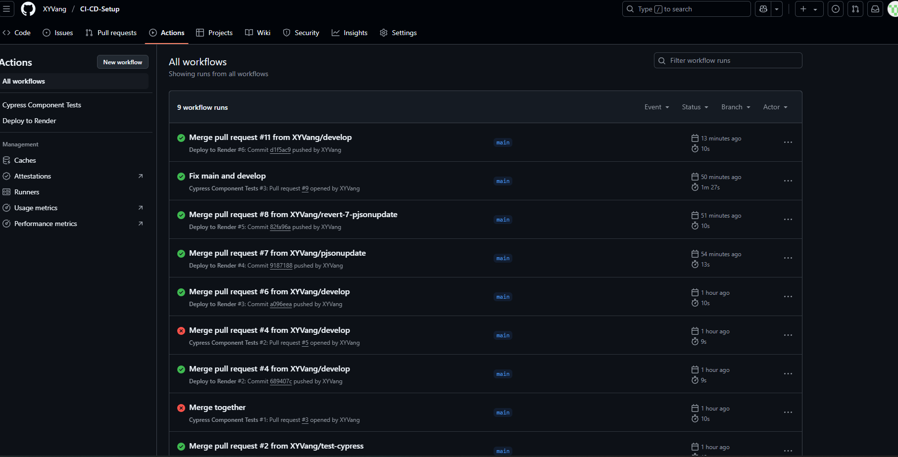
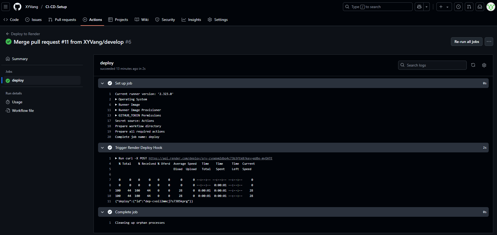
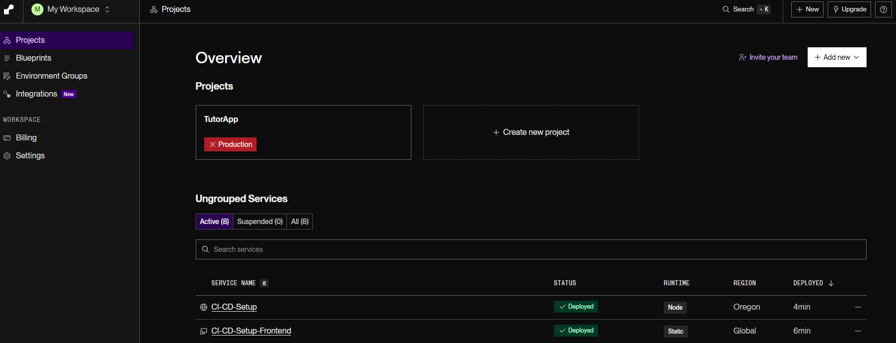

# CI-CD-Setup

## Description

This code allows the function of a CD-CI pipeline in github where Github actions will run tests via Cypress when a pull request is made.

## Table of Contents

- [Usage](#usage)
- [License](#license)
- [How To Contribute](#how-to-contribute)
- [Deployed](#deployed)
- [Questions](#questions)

## Usage

When github users do pull requests it will be tested with Cypress. Once the the checks are through it will automatically redeploy on Render, while Render's auto-deploy is off.

Here are some images that provide the products functionality.

Cypress Tests

Cypress Render Deploy

Render Settings

Front/Back-end deployed on Render

## License

MIT License

## How to Contribute

You can contribute by pulling our repository, making changes and pushing in a different branch.

## Deployed

Here is a deployed site of this code using Render: [https://ci-cd-setup-frontend.onrender.com](https://ci-cd-setup-frontend.onrender.com)

## Questions

Here is my contact info if you have any questions on this file.

Link to my Github: [https://github.com/XYVang](https://github.com/XYVang)

Email me here: xaviervang1999@gmail.com